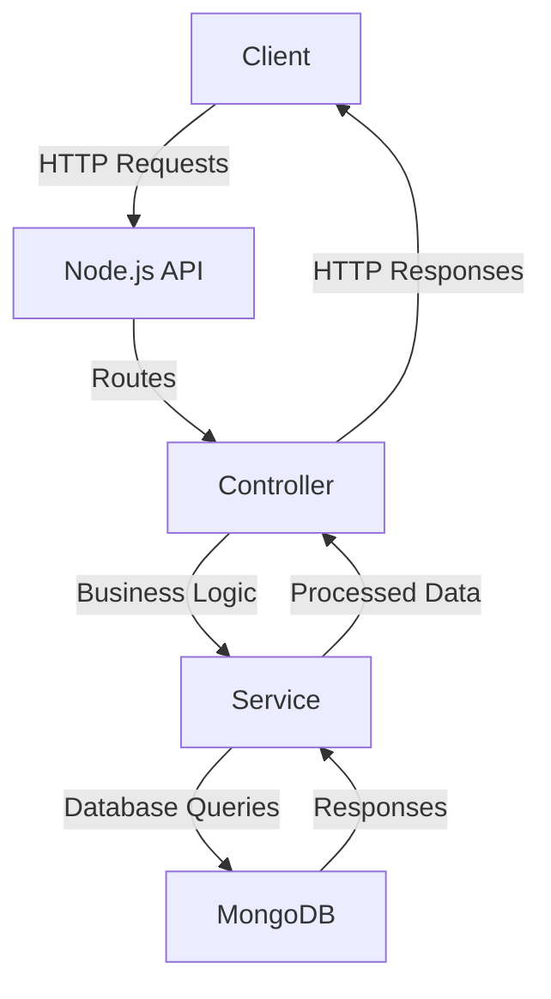
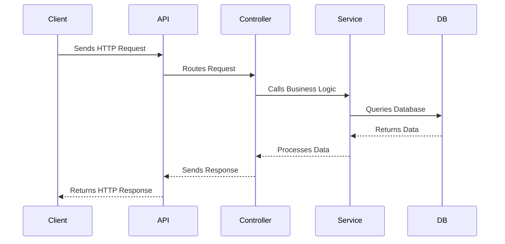

# Sample Node.js Application

This document provides an overview of a sample Node.js application, including its architecture and workflow.

## Application Overview

The sample Node.js application is a RESTful API that performs CRUD operations on a database.

### Features
- Create, Read, Update, and Delete operations.
- Express.js for routing.
- MongoDB as the database.

---

## Architecture Diagram

---

## Workflow Diagram

---

## Reference Links

- [Node.js Documentation](https://nodejs.org/en/docs/)
- [Express.js Guide](https://expressjs.com/)
- [MongoDB Documentation](https://www.mongodb.com/docs/)
- [Mermaid.js Documentation](https://mermaid-js.github.io/mermaid/)
